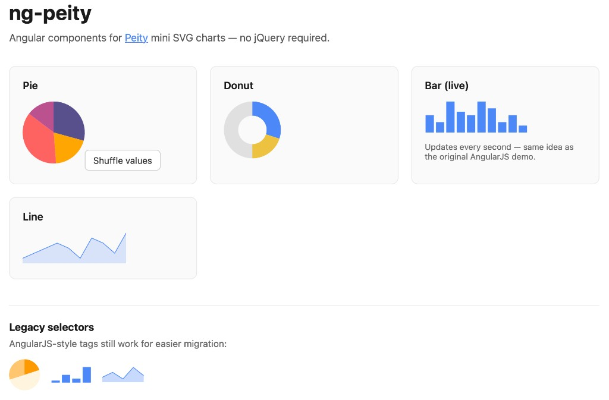

# ng-peity

Angular components for [Peity](https://github.com/benpickles/peity)-style mini SVG charts. Built for **Angular 19+** with standalone components, signal inputs, and [peity-vanilla](https://github.com/railsjazz/peity_vanilla) (no jQuery).

The original AngularJS 1.x implementation lives in [`legacy/`](legacy/).



## Demo

```bash
npm install
npm start
```

Open [http://localhost:4200](http://localhost:4200) for pie, donut, bar, and line examples—including a live-updating bar chart like the old Plunker demo. The screenshot above matches what you’ll see when you run the demo locally.

## Installation

```bash
npm install ng-peity peity-vanilla
```

`peity-vanilla` is a direct dependency of `ng-peity`; you normally only need to install `ng-peity`.

## Usage

Import the chart components you need (all are standalone):

```typescript
import { Component, signal } from '@angular/core';
import { NgPeityBarComponent, NgPeityPieComponent } from 'ng-peity';

@Component({
  selector: 'app-dashboard',
  imports: [NgPeityPieComponent, NgPeityBarComponent],
  template: `
    <ng-peity-pie [data]="pieData()" [options]="pieOptions()" />
    <ng-peity-bar [data]="barData()" [options]="barOptions()" />
  `,
})
export class DashboardComponent {
  readonly pieData = signal([12, 8, 15, 6]);
  readonly pieOptions = signal({ radius: 48 });

  readonly barData = signal([5, 3, 9, 6, 5]);
  readonly barOptions = signal({ width: 120, height: 40 });
}
```

### Components

| Selector | Chart type |
|----------|------------|
| `ng-peity-pie` | Pie |
| `ng-peity-donut` | Donut |
| `ng-peity-bar` | Bar |
| `ng-peity-line` | Line |

### Migrating from AngularJS

The legacy element names still work:

- `inline-pie-chart`
- `inline-donut-chart`
- `inline-bar-chart`
- `inline-line-chart`

Bind `[data]` and `[options]` the same way, but use signal or property bindings instead of `data="PieChart.data"` scope strings.

### Inputs

- **`data`** (required) — `number[]` of values rendered by the chart.
- **`options`** (optional) — Peity options for that chart type (radius, fill, width, height, stroke, etc.). See [Peity documentation](http://benpickles.github.io/peity/) and [peity-vanilla](https://github.com/railsjazz/peity_vanilla).

Charts redraw when `data` or `options` change, and on window or element resize (debounced).

## Development

```bash
npm install
npm run build          # build the library to dist/ng-peity
npm start              # serve the demo app
npm run build:demo     # production build of the demo
```

## License

MIT — see [LICENSE](LICENSE).

## Acknowledgments

- [Peity](https://github.com/benpickles/peity) by Ben Pickles
- [peity-vanilla](https://github.com/railsjazz/peity_vanilla)
- [angular-peity](https://github.com/projectweekend/angular-peity) by Brian Hines (original AngularJS inspiration)
